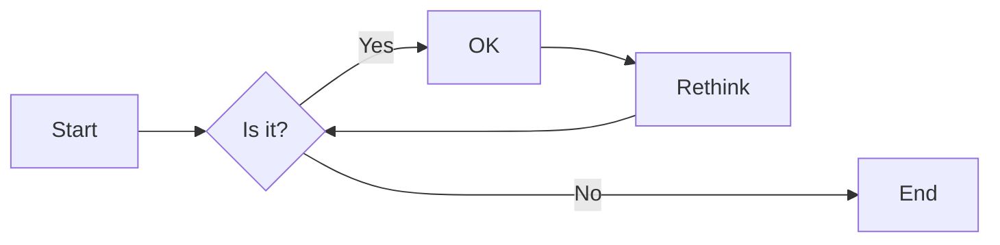
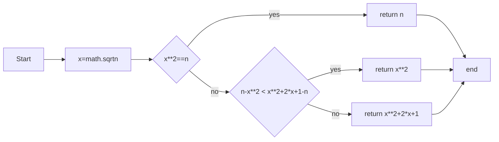
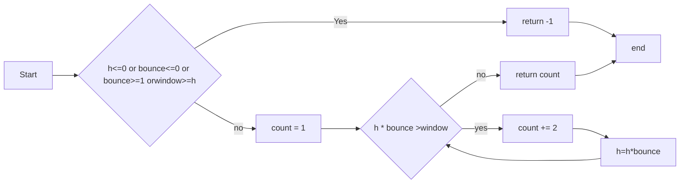
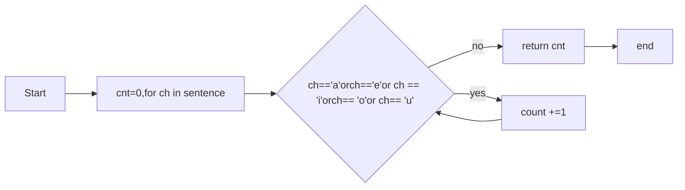
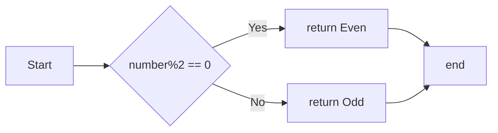

# 实验二 Python变量、简单数据类型

班级： 21计科2班

学号： B20210302216
姓名： 曾令翔

Github地址：<https://github.com/xiang003/ouubai>

CodeWars地址：<https://www.codewars.com/users/ouubai>

---

## 实验目的

1. 使用VSCode编写和运行Python程序
2. 学习Python变量和简单数据类型

## 实验环境

1. Git
2. Python 3.10
3. VSCode
4. VSCode插件

## 实验内容和步骤

### 第一部分

实验环境的安装

1. 安装Python，从Python官网下载Python 3.10安装包，下载后直接点击可以安装：[Python官网地址](https://www.python.org/downloads/)
2. 为了在VSCode集成环境下编写和运行Python程序，安装下列VScode插件
   - Python
   - Python Environment Manager
   - Python Indent
   - Python Extended
   - Python Docstring Generator
   - Jupyter
   - indent-rainbow
   - Jinja

---

### 第二部分

Python变量、简单数据类型和列表简介

完成教材《Python编程从入门到实践》下列章节的练习：

- 第2章 变量和简单数据类型

---

### 第三部分

在[Codewars网站](https://www.codewars.com)注册账号，完成下列Kata挑战：

---

#### 第1题：求离整数n最近的平方数（Find Nearest square number）

难度：8kyu

你的任务是找到一个正整数n的最近的平方数
例如，如果n=111，那么nearest_sq(n)（nearestSq(n)）等于121，因为111比100（10的平方）更接近121（11的平方）。
如果n已经是完全平方（例如n=144，n=81，等等），你需要直接返回n。
代码提交地址
<https://www.codewars.com/kata/5a805d8cafa10f8b930005ba>

---

#### 第2题：弹跳的球（Bouncing Balls）

难度：6kyu

一个孩子在一栋高楼的第N层玩球。这层楼离地面的高度h是已知的。他把球从窗口扔出去。球弹了起来,  例如:弹到其高度的三分之二（弹力为0.66）。他的母亲从离地面w米的窗户向外看,母亲会看到球在她的窗前经过多少次（包括球下落和反弹的时候）？

一个有效的实验必须满足三个条件：

- 参数 "h"（米）必须大于0
- 参数 "bounce "必须大于0且小于1
- 参数 “window "必须小于h。

如果以上三个条件都满足，返回一个正整数，否则返回-1。
**注意:只有当反弹球的高度严格大于窗口参数时，才能看到球。**
代码提交地址
<https://www.codewars.com/kata/5544c7a5cb454edb3c000047/train/python>

---

#### 第3题： 元音统计(Vowel Count)

难度： 7kyu

返回给定字符串中元音的数量（计数）。对于这个Kata，我们将考虑a、e、i、o、u作为元音（但不包括y）。输入的字符串将只由小写字母和/或空格组成。

代码提交地址：
<https://www.codewars.com/kata/54ff3102c1bad923760001f3>

---

#### 第4题：偶数或者奇数（Even or Odd）

难度：8kyu

创建一个函数接收一个整数作为参数，当整数为偶数时返回”Even”当整数位奇数时返回”Odd”。
代码提交地址：
<https://www.codewars.com/kata/53da3dbb4a5168369a0000fe>

### 第四部分

使用Mermaid绘制程序流程图

安装Mermaid的VSCode插件：

- Markdown Preview Mermaid Support
- Mermaid Markdown Syntax Highlighting

使用Markdown语法绘制你的程序绘制程序流程图（至少一个），Markdown代码如下：


显示效果如下：


查看Mermaid流程图语法-->[点击这里](https://mermaid.js.org/syntax/flowchart.html)

使用Markdown编辑器（例如VScode）编写本次实验的实验报告，包括[实验过程与结果](#实验过程与结果)、[实验考查](#实验考查)和[实验总结](#实验总结)，并将其导出为 **PDF格式** 来提交。

## 实验过程与结果

请将实验过程与结果放在这里，包括：

- [第二部分 Python变量、简单数据类型和列表简介](#第二部分)
- [第三部分 Codewars Kata挑战](#第三部分)
  #### 第1题：求离整数n最近的平方数（Find Nearest square number）

难度：8kyu

你的任务是找到一个正整数n的最近的平方数
例如，如果n=111，那么nearest_sq(n)（nearestSq(n)）等于121，因为111比100（10的平方）更接近121（11的平方）。
如果n已经是完全平方（例如n=144，n=81，等等），你需要直接返回n。
代码提交地址
<https://www.codewars.com/kata/5a805d8cafa10f8b930005ba>
```python
import math
def nearest_sq(n):
    x=int(math.sqrt(n))
    if x**2==n:
        return n
    else :
        if n-x**2<(x+1)**2-n :
            return x**2
        else :
            return (x+1)**2
```
#### 第2题：弹跳的球（Bouncing Balls）

难度：6kyu

一个孩子在一栋高楼的第N层玩球。这层楼离地面的高度h是已知的。他把球从窗口扔出去。球弹了起来,  例如:弹到其高度的三分之二（弹力为0.66）。他的母亲从离地面w米的窗户向外看,母亲会看到球在她的窗前经过多少次（包括球下落和反弹的时候）？

一个有效的实验必须满足三个条件：

- 参数 "h"（米）必须大于0
- 参数 "bounce "必须大于0且小于1
- 参数 “window "必须小于h。

如果以上三个条件都满足，返回一个正整数，否则返回-1。
**注意:只有当反弹球的高度严格大于窗口参数时，才能看到球。**
代码提交地址
<https://www.codewars.com/kata/5544c7a5cb454edb3c000047/train/python>
```python

def bouncing_ball(h, bounce, window):
    cnt=1
    if h<=0 or bounce<=0 or bounce>=1 or window >= h :
        return -1
    else :
        while True :
            h=h*bounce
            if h<=window :
                break
            else :
                cnt+=2
        return cnt
```
#### 第3题： 元音统计(Vowel Count)

难度： 7kyu

返回给定字符串中元音的数量（计数）。对于这个Kata，我们将考虑a、e、i、o、u作为元音（但不包括y）。输入的字符串将只由小写字母和/或空格组成。

代码提交地址：
<https://www.codewars.com/kata/54ff3102c1bad923760001f3>
```python
代码如下:
def get_count(sentence):
    cnt=0
    for ch in sentence:
        if ch=='a' or ch=='e' or ch=='i' or ch=='o' or ch=='u' :
              cnt=cnt+1
    return cnt
```
#### 第4题：偶数或者奇数（Even or Odd）

难度：8kyu

创建一个函数接收一个整数作为参数，当整数为偶数时返回”Even”当整数位奇数时返回”Odd”。
代码提交地址：
<https://www.codewars.com/kata/53da3dbb4a5168369a0000fe>
```python
def even_or_odd(number):
    if number%2==0 :
        return 'Even'
    else :
        return 'Odd'
```
- [第四部分 使用Mermaid绘制程序流程图](#第四部分)


  第一题

第二题

第三题

第四题


## 实验考查

请使用自己的语言并使用尽量简短代码示例回答下面的问题，这些问题将在实验检查时用于提问和答辩以及实际的操作。

1. Python中的简单数据类型有那些？我们可以对这些数据类型做哪些操作？
整数（int）：表示整数，例如：1, 2, -3。
浮点数（float）：表示带有小数部分的数字，例如：3.14, -0.5。
布尔值（bool）：表示逻辑值，只有两种取值：True和False。
字符串（str）：表示文本，由一系列字符组成，例如：“Hello, World!”。
None：表示空值或缺失值，通常用于初始化变量或表示函数的返回值为空。
对于这些简单数据类型，我们可以进行各种操作，例如：

运算操作：对于整数和浮点数，我们可以进行算术运算，如加法、减法、乘法、除法等。布尔值可以进行逻辑运算，如与、或、非等。字符串可以进行拼接、重复等操作。
比较操作：可以比较两个值的大小关系，如等于、大于、小于等。比较操作的结果是布尔值。
赋值操作：将一个值赋给一个变量，可以使用等号（=）进行赋值，如：x = 1。
类型转换：可以将一个数据类型转换为另一个数据类型，例如将整数转换为浮点数，字符串转换为整数等。
内置函数：Python提供了许多内置函数，用于对简单数据类型进行操作，如获取字符串长度（len()）、判断字符串是否包含某个子串（in）、转换数据类型（int()、float()等）等。

2. 为什么说Python中的变量都是标签？

简单来说，Python中的变量可以看作是给对象贴上的标签，而不是盒子或容器。变量本身并不存储数据，只是指向内存中的对象。因此，变量可以随时指向不同类型的对象，并且多个变量可以指向同一个对象，实现对象的共享和复用。

3. 有哪些方法可以提高Python代码的可读性？

使用有意义的变量名：选择具有描述性且易于理解的变量名，以便代码的意图更加清晰。避免使用单个字母或无意义的名称。

添加注释：通过注释来解释代码的功能、思路和复杂逻辑，有助于其他人更好地理解代码。注释应该简洁明了，放在关键部分或难以理解的地方。

缩进和空格：正确使用缩进和空格，可以使代码的结构更清晰，方便阅读。保持一致的缩进风格，并使用适当的空格来提高代码的可读性。

模块和函数的划分：合理划分代码为模块和函数，每个模块和函数负责完成特定的任务。这样可以使代码更容易维护和理解，同时也方便进行单元测试和重用。

使用有意义的函数和方法名：函数和方法的命名应该准确描述其功能和目的。使用动词或动词短语命名，以便于理解函数的作用。

适当使用空行：使用空行来分隔代码块，提高代码的可读性。适当的空行有助于组织代码，并使其更易于阅读。

避免过长的行：尽量避免一行代码过长，可以使用换行符（\）将代码分为多行，或者在适当的地方进行换行，使代码更清晰易读。

使用合理的命名约定：遵守常用的命名约定，如使用小写字母和下划线的组合命名变量和函数，使用首字母大写的驼峰命名法命名类等。

减少代码的复杂性：尽量避免过于复杂的逻辑和嵌套结构。使用函数分割复杂的任务，使代码逻辑更加清晰和可读。


## 实验总结

总结一下这次实验你学习和使用到的知识，例如：编程工具的使用、数据结构、程序语言的语法、算法、编程技巧、编程思想。

在这次实验的过程中，我学到了一些python中简单数据的一些简单运用，
如何声明和使用变量，不同类型的数据，数据类型转换，变量的命名规则。
总的来说，这次实验让我对Python编程语言有了更深入的了解，并提高了我的编程能力和思维方式。