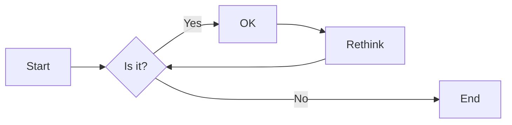
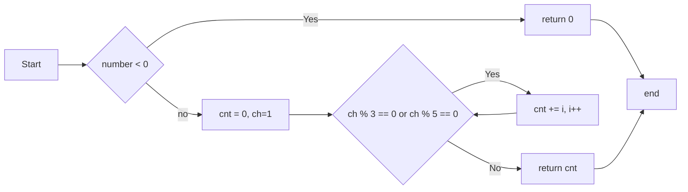
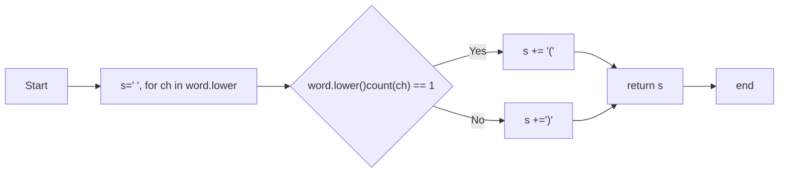
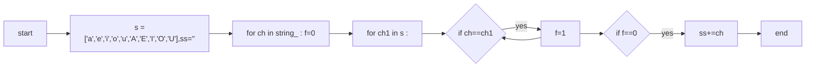

# 实验三 Python列表

班级： 21计科2

学号： B20210302216

姓名： 曾令翔

Github地址：<https://github.com/xiang003/ouubai>

CodeWars地址：<https://www.codewars.com/users/ouubai>

---

## 实验目的

1. 学习Python的简单使用和列表操作
2. 学习Python中的if语句

## 实验环境

1. Git
2. Python 3.10
3. VSCode
4. VSCode插件

## 实验内容和步骤

### 第一部分

Python列表操作

完成教材《Python编程从入门到实践》下列章节的练习：

- 第3章 列表简介
- 第4章 操作列表
- 第5章 if语句

---

### 第二部分

在[Codewars网站](https://www.codewars.com)注册账号，完成下列Kata挑战：

---

#### 第一题：3和5的倍数（Multiples of 3 or 5）

难度： 6kyu

如果我们列出所有低于 10 的 3 或 5 倍数的自然数，我们得到 3、5、6 和 9。这些数的总和为 23. 完成一个函数，使其返回小于某个整数的所有是3 或 5 的倍数的数的总和。此外，如果数字为负数，则返回 0。

注意：如果一个数同时是3和5的倍数，应该只被算一次。

**提示：首先使用列表解析得到一个列表，元素全部是3或者5的倍数。
使用sum函数可以获取这个列表所有元素的和.**

代码提交地址：
<https://www.codewars.com/kata/514b92a657cdc65150000006>

---

#### 第二题： 重复字符的编码器（Duplicate Encoder）

难度： 6kyu

本练习的目的是将一个字符串转换为一个新的字符串，如果新字符串中的每个字符在原字符串中只出现一次，则为"("，如果该字符在原字符串中出现多次，则为")"。在判断一个字符是否是重复的时候，请忽略大写字母。

例如:

```python
"din"      =>  "((("
"recede"   =>  "()()()"
"Success"  =>  ")())())"
"(( @"     =>  "))(("
```

代码提交地址:
<https://www.codewars.com/kata/54b42f9314d9229fd6000d9c>

---

#### 第三题：括号匹配（Valid Braces）

难度：6kyu

写一个函数，接收一串括号，并确定括号的顺序是否有效。如果字符串是有效的，它应该返回True，如果是无效的，它应该返回False。
例如：

```python
"(){}[]" => True 
"([{}])" => True
 "(}" => False
 "[(])" => False 
"[({})](]" => False
```

**提示：
python中没有内置堆栈数据结构，可以直接使用`list`来作为堆栈，其中`append`方法用于入栈，`pop`方法可以出栈。**

代码提交地址
<https://www.codewars.com/kata/5277c8a221e209d3f6000b56>

---

#### 第四题： 从随机三元组中恢复秘密字符串(Recover a secret string from random triplets)

难度： 4kyu

有一个不为你所知的秘密字符串。给出一个随机三个字母的组合的集合，恢复原来的字符串。

这里的三个字母的组合被定义为三个字母的序列，每个字母在给定的字符串中出现在下一个字母之前。"whi "是字符串 "whatisup "的一个三个字母的组合。

作为一种简化，你可以假设没有一个字母在秘密字符串中出现超过一次。

对于给你的三个字母的组合，除了它们是有效的三个字母的组合以及它们包含足够的信息来推导出原始字符串之外，你可以不做任何假设。特别是，这意味着秘密字符串永远不会包含不出现在给你的三个字母的组合中的字母。

测试用例：

```python
secret = "whatisup"
triplets = [
  ['t','u','p'],
  ['w','h','i'],
  ['t','s','u'],
  ['a','t','s'],
  ['h','a','p'],
  ['t','i','s'],
  ['w','h','s']
]
test.assert_equals(recoverSecret(triplets), secret)
```

代码提交地址：
<https://www.codewars.com/kata/53f40dff5f9d31b813000774/train/python>

提示：

- 利用集合去掉`triplets`中的重复字母，得到字母集合`letters`，最后的`secret`应该由集合中的字母组成，`secret`长度也等于该集合。

```python
letters = {letter for triplet in triplets for letter in triplet }
length = len(letters)
```

- 创建函数`check_first_letter(triplets, first_letter)`，检测一个字母是不是secret的首字母，返回True或者False。
- 创建函数`remove_first_letter(triplets, first_letter)`,  从三元组中去掉首字母，返回新的三元组。
- 遍历字母集合letters，利用上面2个函数得到最后的结果`secret`。

---

#### 第五题： 去掉喷子的元音（Disemvowel Trolls）

难度： 7kyu

喷子正在攻击你的评论区!
处理这种情况的一个常见方法是删除喷子评论中的所有元音(字母：a,e,i,o,u)，以消除威胁。
你的任务是写一个函数，接收一个字符串并返回一个去除所有元音的新字符串。
例如，字符串 "This website is for losers LOL!"   将变成 "Ths wbst s fr lsrs LL!".

注意：对于这个Kata来说，y不被认为是元音。
代码提交地址：
<https://www.codewars.com/kata/52fba66badcd10859f00097e>

提示：

- 首先使用列表解析得到一个列表，列表中所有不是元音的字母。
- 使用字符串的join方法连结列表中所有的字母，例如：

```python
last_name = "lovelace"
letters = [letter for letter in last_name ]
print(letters) # ['l', 'o', 'v', 'e', 'l', 'a', 'c', 'e']
name = ''.join(letters) # name = "lovelace"
```

---

### 第三部分

使用Mermaid绘制程序流程图

安装VSCode插件：

- Markdown Preview Mermaid Support
- Mermaid Markdown Syntax Highlighting

使用Markdown语法绘制你的程序绘制程序流程图（至少一个），Markdown代码如下：


显示效果如下：



查看Mermaid流程图语法-->[点击这里](https://mermaid.js.org/syntax/flowchart.html)

使用Markdown编辑器（例如VScode）编写本次实验的实验报告，包括[实验过程与结果](#实验过程与结果)、[实验考查](#实验考查)和[实验总结](#实验总结)，并将其导出为 **PDF格式** 来提交。

## 实验过程与结果

请将实验过程与结果放在这里，包括：

- [第一部分 Python列表操作和if语句](#第一部分)
- [第二部分 Codewars Kata挑战](#第二部分)
  
  第一题
```bash
def solution(number):
    if number < 0 :
        return 0
    cnt=0
    for ch in range(1,number) :
        if ch%3==0 or ch%5==0 :
            cnt+=ch
    return cnt
```
第二题
```bash
def duplicate_encode(word):
    s=""
    for ch in word.lower() :
        if word.lower().count(ch)==1 :
            s+='('
        else :
            s+=')'
    return s
```
第三题
```bash
def valid_braces(string):
    s =[]
    mp ={'}':'{',')':'(',']':'['}
    for ch in string :
        if ch=='[' or ch=='(' or ch=='{' :
            s.append(ch)
        else :
             if(s==[] or mp[ch]!=s[-1]) :
                    return False
             else :
                     s.pop()
    if s==[] :
        return True
    else :
        return False
```
第五题
```bash
def disemvowel(string_):
    s =['a','e','i','o','u','A','E','I','O','U']
    ss=""
    for ch in string_ :
        f=0
        for ch1 in s :
            if ch==ch1 :
                f=1
        if f==0 :
            ss+=ch
    return ss
```
- [第三部分 使用Mermaid绘制程序流程图](#第三部分)

第一题

第二题流程图

第五题

**注意：不要使用截图，Markdown文档转换为Pdf格式后，截图可能会无法显示。**

## 实验考查

请使用自己的语言并使用尽量简短代码示例回答下面的问题，这些问题将在实验检查时用于提问和答辩以及实际的操作。

1. Python中的列表可以进行哪些操作？

1.添加元素：使用append()方法在列表末尾添加一个元素，使用insert()方法在指定位置插入一个元素，使用extend()方法添加多个元素。

2.访问元素：可以通过索引访问列表中的元素，索引从0开始。例如，使用my_list[0]可以访问列表中的第一个元素。

3.切片操作：可以通过切片操作获取列表中的子列表。例如，使用my_list[1:3]可以获取索引1到索引2的元素，包括索引1但不包括索引3。

4.更新元素：可以通过索引来更新列表中的元素。例如，使用my_list[0] = 5将第一个元素更新为5。

5.删除元素：可以使用del语句删除列表中的元素，或者使用remove()方法删除指定的元素。

6.长度和计数：可以使用len()函数获取列表的长度，使用count()方法统计指定元素在列表中出现的次数。

7.排序：可以使用sort()方法对列表进行升序排序，或者使用sorted()函数返回一个排序后的副本。

8.其他常见操作：包括列表的拼接、重复、查找元素的索引等。

1. 哪两种方法可以用来对Python的列表排序？这两种方法有和区别？

   Python中对列表进行排序的两种方法是使用sort()方法和sorted()函数。其中，sort()方法会原地改变列表的顺序，而sorted()函数返回一个新的排序后的列表，不改变原列表的顺序。这两种方法都可以通过参数进行定制化排序。
2. 如何将Python列表逆序打印？
 
   要将Python列表逆序打印，可以使用切片操作符[::-1]来实现，如reversed_list = my_list[::-1]。这样可以得到逆序打印后的列表。
3. Python中的列表执行哪些操作时效率比较高？哪些操作效率比较差？是否有类似的数据结构可以用来替代列表？
   
&emsp;&emsp;在Python中，列表执行以下操作时效率较高：

&emsp;&emsp;访问列表中的元素：可以通过索引直接访问列表中的元素，时间复杂度为O(1)。

&emsp;&emsp;在列表末尾添加元素：使用append()方法在列表末尾添加元素，时间复杂度为O(1)。

&emsp;&emsp;切片操作：通过切片操作可以获取列表的子列表，时间复杂度为O(k)，其中k是切片的长度。

&emsp;&emsp;而以下操作的效率较低：

&emsp;&emsp;在列表的开头或中间插入元素：使用insert()方法在列表的开头或中间插入元素，平均时间复杂度为O(n)，其中n是列表的长度。

&emsp;&emsp;删除指定位置的元素：使用pop()方法删除指定位置的元素，平均时间复杂度为O(n)，其中n是列表的长度。
&emsp;&emsp;列表的扩容：当列表的元素数量超过当前容量时，需要进行扩容操作，时间复杂度为O(n)，其中n是列表的长度。

&emsp;&emsp;如果需要在频繁进行插入和删除操作的场景中，可以考虑使用链表（linked list）作为替代。链表的插入和删除操作的平均时间复杂度为O(1)。然而，链表在访问元素时的效率较低，需要遍历链表来找到目标元素，平均时间复杂度为O(n)。因此，根据具体的使用场景，可以选择适合的数据结构来提高操作的效率。
5. 阅读《Fluent Python》Chapter 2. An Array of Sequence - Tuples Are Not Just Immutable Lists小节（p30-p35）。总结该小节的主要内容。
 
&emsp;&emsp;1.元组是不可变的序列：元组是一种不可变的序列，类似于列表（list），但元组的元素不能被修改。元组可以通过逗号分隔的方式创建，也可以使用圆括号将元素括起来创建。例如，t = 1, 2, 3或t = (1, 2, 3)。

&emsp;&emsp;2.元组的不可变性：元组的不可变性意味着元组的元素不能被修改、添加或删除。但是，如果元组中的元素是可变的对象，如列表，那么可以修改该可变对象的内容，但不能修改元组中的引用。

&emsp;&emsp;3.元组的解包：元组可以通过解包（unpacking）的方式将元组的元素赋值给多个变量。解包可以通过将元组的变量放在赋值语句的左侧来实现。例如，a, b, c = t将元组t的元素依次赋值给变量a、b和c。

&emsp;&emsp;4.元组作为记录：元组可以用来表示记录，其中每个元素表示一个字段的值。这种用法可以通过元组的解包和命名元组（namedtuple）来实现。命名元组是一种具有字段名的元组，可以通过字段名来访问元组的元素。

&emsp;&emsp;5.元组作为函数的返回值：元组经常被用作函数的返回值，可以将多个值打包成一个元组并返回。函数的调用者可以使用解包的方式获取返回的多个值。
## 实验总结

总结一下这次实验你学习和使用到的知识，例如：编程工具的使用、数据结构、程序语言的语法、算法、编程技巧、编程思想。

&emsp;&emsp;1.列表的基本操作：学会了如何创建列表、访问列表中的元素、在列表中添加和删除元素、使用切片操作获取子列表等基本操作。

&emsp;&emsp;2.列表的可变性：了解到列表是可变的，可以修改列表中的元素，也可以通过各种方法对列表进行修改。

&emsp;&emsp;3.列表的索引和切片：学会了使用索引来访问列表中的单个元素，以及使用切片操作来获取列表的子列表。

&emsp;&emsp;4.列表的方法：学习了一些常用的列表方法，如append()、insert()、pop()等，这些方法可以用来在列表中添加、插入、删除元素。

&emsp;&emsp;5.列表的性能：了解到列表在访问和添加元素时的性能较好，而在插入和删除元素时的性能较差。你还了解到列表的扩容操作可能会导致性能下降。

&emsp;&emsp;6.链表的优势：通过对比实验，发现链表在插入和删除操作上的性能优势，尤其是在频繁进行插入和删除操作的场景中。