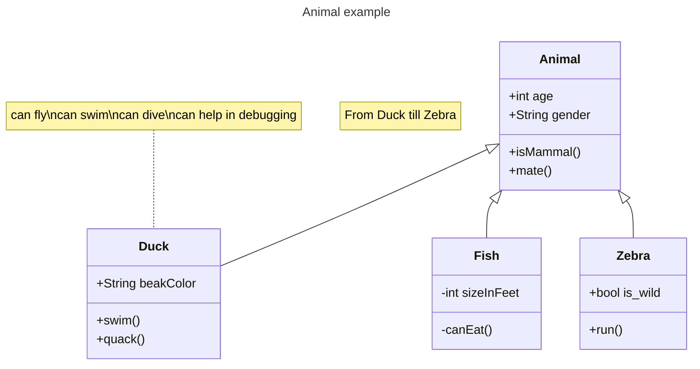
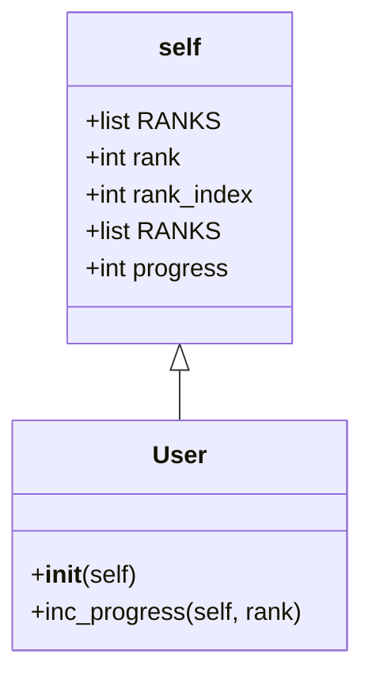

# 实验七 Python面向对象编程

班级： 21计科2

学号： B20210302216

姓名： 曾令翔

Github地址：<https://github.com/xiang003/ouubai>

CodeWars地址：<https://www.codewars.com/users/ouubai>

---

## 实验目的

1. 学习Python类和继承的基础知识
2. 学习namedtuple和DataClass的使用

## 实验环境

1. Git
2. Python 3.10
3. VSCode
4. VSCode插件

## 实验内容和步骤

### 第一部分

Python面向对象编程

完成教材《Python编程从入门到实践》下列章节的练习：

- 第9章 类

---

### 第二部分

在[Codewars网站](https://www.codewars.com)注册账号，完成下列Kata挑战：

---

#### 第一题：面向对象的海盗

难度： 8kyu

啊哈，伙计!

你是一个小海盗团的首领。而且你有一个计划。在OOP的帮助下，你希望建立一个相当有效的系统来识别船上有大量战利品的船只。
对你来说，不幸的是，现在的人很重，那么你怎么知道一艘船上装的是黄金而不是人呢？

你首先要写一个通用的船舶类。

```python
class Ship:
    def __init__(self, draft, crew):
        self.draft = draft
        self.crew = crew
```

每当你的间谍看到一艘新船进入码头，他们将根据观察结果创建一个新的船舶对象。

- `draft`吃水 - 根据船在水中的高度来估计它的重量
- `crew`船员 - 船上船员的数量

`Titanic = Ship(15, 10)`

任务

你可以访问船舶的 "draft(吃水) "和 "crew(船员)"。"draft(吃水) "是船的总重量，"船员 "是船上的人数。
每个船员都会给船的吃水增加1.5个单位。如果除去船员的重量后，吃水仍然超过20，那么这艘船就值得掠夺。任何有这么重的船一定有很多战利品!
添加方法
`is_worth_it`
来决定这艘船是否值得掠夺。

例如：

```python
Titanic.is_worth_it()
False
```

祝你好运，愿你能找到金子!

代码提交地址：
<https://www.codewars.com/kata/54fe05c4762e2e3047000add>

---

#### 第二题： 搭建积木

难度：7kyu

写一个创建Block的类（Duh.）
构造函数应该接受一个数组作为参数，这个数组将包含3个整数，其形式为`[width, length, height]`，Block应该由这些整数创建。

定义这些方法:

- `get_width()` return the width of the `Block`
- `get_length()` return the length of the `Block`
- `get_height()` return the height of the `Block`
- `get_volume()` return the volume of the `Block`
- `get_surface_area()` return the surface area of the `Block`

例子：

```python
b = Block([2,4,6]) # create a `Block` object with a width of `2` a length of `4` and a height of `6`
b.get_width() # return 2    
b.get_length() # return 4
b.get_height() # return 6
b.get_volume() # return 48
b.get_surface_area() # return 88
```

注意： 不需要检查错误的参数。

代码提交地址：
<https://www.codewars.com/kata/55b75fcf67e558d3750000a3>

---

#### 第三题： 分页助手

难度：5kyu

在这个练习中，你将加强对分页的掌握。你将完成PaginationHelper类，这是一个实用类，有助于查询与数组有关的分页信息。
该类被设计成接收一个值的数组和一个整数，表示每页允许多少个项目。集合/数组中包含的值的类型并不相关。

下面是一些关于如何使用这个类的例子：

```python
helper = PaginationHelper(['a','b','c','d','e','f'], 4)
helper.page_count() # should == 2
helper.item_count() # should == 6
helper.page_item_count(0)  # should == 4
helper.page_item_count(1) # last page - should == 2
helper.page_item_count(2) # should == -1 since the page is invalid

# page_index takes an item index and returns the page that it belongs on
helper.page_index(5) # should == 1 (zero based index)
helper.page_index(2) # should == 0
helper.page_index(20) # should == -1
helper.page_index(-10) # should == -1 because negative indexes are invalid
```

代码提交地址：
<https://www.codewars.com/kata/515bb423de843ea99400000a>


---

#### 第四题： 向量（Vector）类

难度： 5kyu

创建一个支持加法、减法、点积和向量长度的向量（Vector）类。

举例来说：

```python
a = Vector([1, 2, 3])
b = Vector([3, 4, 5])
c = Vector([5, 6, 7, 8])

a.add(b)      # should return a new Vector([4, 6, 8])
a.subtract(b) # should return a new Vector([-2, -2, -2])
a.dot(b)      # should return 1*3 + 2*4 + 3*5 = 26
a.norm()      # should return sqrt(1^2 + 2^2 + 3^2) = sqrt(14)
a.add(c)      # raises an exception
```

如果你试图对两个不同长度的向量进行加减或点缀，你必须抛出一个错误。
向量类还应该提供：

- 一个 `__str__` 方法，这样 `str(a) === '(1,2,3)'` 
- 一个equals方法，用来检查两个具有相同成分的向量是否相等。

注意：测试案例将利用用户提供的equals方法。

代码提交地址：
<https://www.codewars.com/kata/526dad7f8c0eb5c4640000a4>

---

#### 第五题： Codewars风格的等级系统

难度： 4kyu

编写一个名为User的类，用于计算用户在类似于Codewars使用的排名系统中的进步量。

业务规则：

- 一个用户从等级-8开始，可以一直进步到8。
- 没有0（零）等级。在-1之后的下一个等级是1。
- 用户将完成活动。这些活动也有等级。
- 每当用户完成一个有等级的活动，用户的等级进度就会根据活动的等级进行更新。
- 完成活动获得的进度是相对于用户当前的等级与活动的等级而言的。
- 用户的等级进度从零开始，每当进度达到100时，用户的等级就会升级到下一个等级。
- 在上一等级时获得的任何剩余进度都将被应用于下一等级的进度（我们不会丢弃任何进度）。例外的情况是，如果没有其他等级的进展（一旦你达到8级，就没有更多的进展了）。
- 一个用户不能超过8级。
- 唯一可接受的等级值范围是-8,-7,-6,-5,-4,-3,-2,-1,1,2,3,4,5,6,7,8。任何其他的值都应该引起错误。

逻辑案例：

- 如果一个排名为-8的用户完成了一个排名为-7的活动，他们将获得10的进度。
- 如果一个排名为-8的用户完成了排名为-6的活动，他们将获得40的进展。
- 如果一个排名为-8的用户完成了排名为-5的活动，他们将获得90的进展。
- 如果一个排名-8的用户完成了排名-4的活动，他们将获得160个进度，从而使该用户升级到排名-7，并获得60个进度以获得下一个排名。
- 如果一个等级为-1的用户完成了一个等级为1的活动，他们将获得10个进度（记住，零等级会被忽略）。

代码案例：

```python
user = User()
user.rank # => -8
user.progress # => 0
user.inc_progress(-7)
user.progress # => 10
user.inc_progress(-5) # will add 90 progress
user.progress # => 0 # progress is now zero
user.rank # => -7 # rank was upgraded to -7
```

代码提交地址：
<https://www.codewars.com/kata/51fda2d95d6efda45e00004e>

---

### 第三部分

使用Mermaid绘制程序的**类图**

安装VSCode插件：

- Markdown Preview Mermaid Support
- Mermaid Markdown Syntax Highlighting

使用Markdown语法绘制你的程序绘制程序类图（至少一个），Markdown代码如下：


显示效果如下：



查看Mermaid类图的语法-->[点击这里](https://mermaid.js.org/syntax/classDiagram.html)

使用Markdown编辑器（例如VScode）编写本次实验的实验报告，包括[实验过程与结果](#实验过程与结果)、[实验考查](#实验考查)和[实验总结](#实验总结)，并将其导出为 **PDF格式** 来提交。

## 实验过程与结果

请将实验过程与结果放在这里，包括：

- [第一部分 Python面向对象编程](#第一部分)
- [第二部分 Codewars Kata挑战](#第二部分)
- 
  第一题:
```python
class Ship:
        
    def __init__(self, draft, crew):
        self.draft = draft
        self.crew = crew
    
    def is_worth_it(self):
        return self.draft - self.crew * 1.5 > 20    
        
Titanic = Ship(15, 10)
print(Titanic.is_worth_it())

treasure_ship = Ship(35.1, 10)
print(treasure_ship.is_worth_it())
```
第二题:
```python
class Block(object):
    def __init__(self, wlh):
        self.w, self.l, self.h = w,l,h = wlh
        self.v = w*h*l
        self.a = 2 * (w*l + w*h + l*h)
    
    def get_width(self):        return self.w
    def get_length(self):       return self.l
    def get_height(self):       return self.h
    def get_volume(self):       return self.v
    def get_surface_area(self): return self.a
```
第三题:
```python
import math

class PaginationHelper:
    
    def __init__(self, collection, items_per_page):
        self.collection = collection
        self.items_per_page = items_per_page
        
    def item_count(self):
        return len(self.collection)
    
    # 总页数
    def page_count(self):
        
        # 总条目数 / 每页条目数，然后向上取整
        return math.ceil(self.item_count() / self.items_per_page)
    
    def page_item_count(self, page_index):
        
        # 页数为负数或者页数超过总页数
        if page_index < 0 or page_index >= self.page_count():
            return -1

        # 最后一页
        elif page_index == self.page_count() - 1: 
            
            # 如果是6%4，那么最后一页就是2
            # 如果是8%4，那么最后一页就是0，说明最后一页是满的，应该返回4
            last_page = self.item_count() % self.items_per_page
            
            return self.items_per_page if last_page == 0 else last_page
        
        # 其他页
        else:
            return self.items_per_page
        
    def page_index(self, item_index):
        # 非法的情况
        if item_index < 0 or item_index >= self.item_count():
            return -1
        else:
            return item_index // self.items_per_page
```
第四题:
```python
from math import sqrt

class Vector:

    def __init__(self, iterable):
        self._v = tuple(x for x in iterable)

    # 把打印元组时的空格去掉
    def __str__(self):
        return str(self._v).replace(' ', '')
    
    # 检查两个向量是否长度相等    
    def check(self, other):
        if not len(self._v) == len(other._v):
            raise ValueError('Vectors of different length')

    def add(self, other):
        self.check(other)
        return Vector(s + o for s, o in zip(self._v, other._v))

    def subtract(self, other):
        self.check(other)
        return Vector(s - o for s, o in zip(self._v, other._v))

    def dot(self, other):
        self.check(other)
        return sum(s * o for s, o in zip(self._v, other._v))

    def norm(self):
        return sqrt(sum(pow(x,2) for x in self._v))

    def equals(self, other):
        return self._v == other._v
```
第五题:
```python
class User ():    
    def __init__ (self):
        self.RANKS = [-8, -7, -6, -5, -4, -3, -2, -1, 1, 2, 3, 4, 5, 6, 7, 8]
        self.rank = -8
        self.rank_index = 0
        self.progress = 0
        
    def inc_progress (self, rank):
        rank_index = self.RANKS.index(rank)
        
        # 计算rank的差，得出可以获得多少进度
        
        # 完成的是同等级的题目
        if rank_index == self.rank_index:
            self.progress += 3
            
        # 完成的是比当前等级低一级的题目
        elif rank_index == self.rank_index - 1:
            self.progress += 1
            
        # 完成的是比当前等级高的题目
        elif rank_index > self.rank_index:
            difference = rank_index - self.rank_index
            self.progress += 10 * difference * difference
        
        if self.rank == 8:
                self.progress = 0
                return
        # 如果进度大于100，升级，每减去100进度，升一级    
        while self.progress >= 100:
            
            self.rank_index += 1
            self.rank = self.RANKS[self.rank_index]
            self.progress -= 100    
            
            if self.rank == 8:
                self.progress = 0
                return
        
            # 如果升到8级（最高级），进度被置为0
```
- [第三部分 使用Mermaid绘制程序流程图](#第三部分)
第五题:

注意代码需要使用markdown的代码块格式化，例如Git命令行语句应该使用下面的格式：


显示效果如下：

```bash
git init
git add .
git status
git commit -m "first commit"
```

如果是Python代码，应该使用下面代码块格式，例如：


显示效果如下：

```python
def add_binary(a,b):
    return bin(a+b)[2:]
```

代码运行结果的文本可以直接粘贴在这里。

**注意：不要使用截图，Markdown文档转换为Pdf格式后，截图可能会无法显示。**

## 实验考查

请使用自己的语言并使用尽量简短代码示例回答下面的问题，这些问题将在实验检查时用于提问和答辩以及实际的操作。

1. Python的类中__init__方法起什么作用？
   
   __init__方法是Python中的构造函数，用于初始化类的实例。当创建类的实例时，__init__方法会自动调用，可以在这个方法中对实例的属性进行初始化操作。
2. Python语言中如何继承父类和改写（override）父类的方法。
   
   要在Python中继承父类并改写（override）父类的方法，可以创建一个新的子类，并在子类中定义与父类同名的方法。在子类中定义的方法会覆盖父类中的同名方法，从而实现方法的改写。通过调用super()函数，还可以在子类中调用父类的方法。
3. Python类有那些特殊的方法？它们的作用是什么？请举三个例子并编写简单的代码说明。
   
   Python类有许多特殊的方法，也称为魔术方法或双下划线方法，用于实现类的特定行为和功能。以下是三个例子：

   1.__init__: 用于初始化类的实例，在创建对象时自动调用。
```python
   class Person:
    def __init__(self, name):
        self.name = name

person = Person("Alice")
print(person.name)  # 输出 "Alice"
```
   2.__str__: 用于返回对象的字符串表示，可以通过print()函数打印对象时自动调用。
 ```python
   class Person:
    def __init__(self, name):
        self.name = name

    def __str__(self):
        return f"Person: {self.name}"

person = Person("Bob")
print(person)  # 输出 "Person: Bob"

```
   3.__add__: 用于定义对象相加的行为，可以通过"+"运算符进行调用。
```python
class Point:
    def __init__(self, x, y):
        self.x = x
        self.y = y

    def __add__(self, other):
        return Point(self.x + other.x, self.y + other.y)

p1 = Point(1, 2)
p2 = Point(3, 4)
result = p1 + p2
print(result.x, result.y)  # 输出 "4 6"
```
## 实验总结

总结一下这次实验你学习和使用到的知识，例如：编程工具的使用、数据结构、程序语言的语法、算法、编程技巧、编程思想。


在这次实验中，我学习了Python类和继承的基础知识。我了解了类的定义、实例化、属性和方法的使用，以及如何继承父类和改写父类的方法。我还学习了特殊方法（魔术方法）的使用，例如__init__、__str__和__add__等。这些知识让我能够更好地理解面向对象编程的概念和实践。

此外，我还学习了Python中的数据结构，如namedtuple和DataClass的使用。namedtuple允许创建具有命名字段的元组，而DataClass是Python 3.7中引入的用于创建不可变数据类的工具。这些数据结构提供了更方便的方式来管理数据，并且可以提高代码的可读性和可维护性。

在编程工具方面，我使用了Python编程语言和相关的标准库，如collections模块中的namedtuple类和dataclasses模块中的DataClass。我还使用了一些基本的编程技巧，如如何定义类、实例化对象、重写方法等。

总的来说，这次实验让我更深入地了解了面向对象编程的概念和实践，并学习了Python中一些方便的数据结构和工具，这些知识对我今后在编程中的实践和应用都将大有裨益。